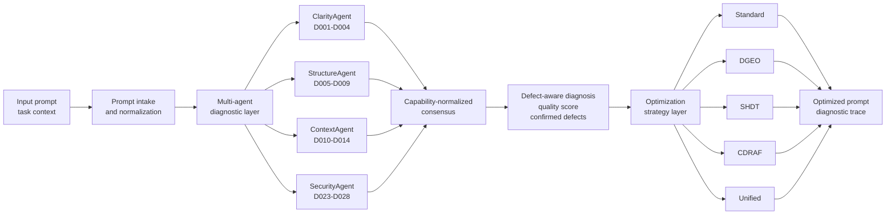

# PromptOptix

**Defect-aware prompt optimization with multi-agent diagnosis and multi-strategy rewriting.**

[](https://www.python.org/downloads/)
[](https://fastapi.tiangolo.com/)
[](https://react.dev/)

PromptOptix is a research-oriented prompt engineering system that analyzes prompts for defects, explains what is wrong, and applies optimization strategies to produce stronger prompts. It combines four specialist diagnostic agents, a 28-defect taxonomy, a 41-technique prompt engineering registry, and several optimization strategies including DGEO, SHDT, CDRAF, and a Unified pipeline.

## What It Does

- Detects prompt defects using four specialist agents.
- Aggregates findings with capability-normalized consensus.
- Scores prompt quality on a 0-10 scale.
- Rewrites prompts using defect-to-technique guidance.
- Supports multiple optimization strategies: Standard, DGEO, SHDT, CDRAF, and Unified.
- Streams analysis and Unified optimization progress with Server-Sent Events.
- Provides a React frontend for analysis, optimization, techniques, and history.
- Includes evaluation scripts and benchmark data for research experiments.

## Research Framing

PromptOptix is built around a defect-aware view of prompt optimization:

1. Diagnose the prompt before rewriting it.
2. Identify concrete defect types rather than relying only on generic feedback.
3. Select optimization strategies and rewrite guidance from the detected defects.
4. Return both an optimized prompt and a transparent diagnostic trace.

The full taxonomy contains 28 defects across six categories. The current implementation directly operationalizes four specialist agent categories:

| Agent | Implemented Focus | Defect IDs |
|---|---|---|
| ClarityAgent | Specification and Intent | D001-D004 |
| StructureAgent | Structure and Formatting | D005-D009 |
| ContextAgent | Context and Memory | D010-D014 |
| SecurityAgent | Security and Safety | D023-D028 |

The current four-agent implementation directly covers 20 of the 28 taxonomy defects. The technique registry contains 41 prompt engineering techniques, with mappings for most taxonomy defects.

## Optimization Strategies

| Strategy | Purpose |
|---|---|
| Standard | Fast single-pass rewrite using weighted defect-to-technique mapping. |
| DGEO | Defect-Guided Evolutionary Optimization using multiple defect-focused prompt variants. |
| SHDT | Score-History Defect Trajectory refinement that tracks score changes across iterations. |
| CDRAF | Critic-Driven Refinement with Agent Feedback using specialist critique loops. |
| Unified | Chained multi-paradigm pipeline combining Standard, DGEO, SHDT, and CDRAF. |

## Architecture



More detailed diagrams are available in [architecture_diagrams.md](architecture_diagrams.md).

## Tech Stack

| Layer | Tools |
|---|---|
| Backend | FastAPI, Pydantic, asyncio |
| Frontend | React 19, Vite, TypeScript, Tailwind CSS |
| LLM providers | Gemini, Anthropic, Groq, OpenAI |
| Evaluation | pandas, scipy, datasets, rouge-score, pytest |
| Storage | SQLite-backed optimization history |

## Quick Start

### Prerequisites

- Python 3.11+
- Node.js 18+
- At least one LLM provider API key

### 1. Create The Backend Environment

```powershell
python -m venv .venv
.\.venv\Scripts\Activate.ps1
pip install -r backend/requirements.txt
```

For macOS or Linux:

```bash
python -m venv .venv
source .venv/bin/activate
pip install -r backend/requirements.txt
```

### 2. Configure Environment Variables

```powershell
Copy-Item .env.example .env
```

Then edit `.env` and set at least one provider key:

```env
DEFAULT_PROVIDER=gemini
GEMINI_API_KEY=your_key_here

JUDGE_PROVIDER=gemini
JUDGE_MODEL=gemini-2.5-pro
```

Supported provider keys:

- `GEMINI_API_KEY`
- `ANTHROPIC_API_KEY`
- `GROQ_API_KEY`
- `OPENAI_API_KEY`

### 3. Install Frontend Dependencies

```powershell
cd frontend
npm install
Copy-Item .env.example .env
cd ..
```

The default frontend API URL is:

```env
VITE_API_URL=http://localhost:8000
```

### 4. Start The Backend

```powershell
uvicorn backend.app:app --reload --port 8000
```

Backend URLs:

- API root: `http://localhost:8000`
- Swagger docs: `http://localhost:8000/docs`
- Health check: `http://localhost:8000/api/health`

### 5. Start The Frontend

Open a second terminal:

```powershell
cd frontend
npm run dev
```

Frontend URL:

- `http://localhost:5173`

## API Overview

### Analyze A Prompt

`POST /api/analyze`

```json
{
  "prompt": "Write a function to sort numbers",
  "task_type": "code_generation",
  "domain": "software_engineering",
  "include_agent_breakdown": true
}
```

Streaming version:

`POST /api/analyze/stream`

### Standard Optimization

`POST /api/optimize`

```json
{
  "prompt": "Write code to sort numbers",
  "optimization_level": "balanced",
  "max_techniques": 5,
  "task_type": "code_generation",
  "domain": "software_engineering"
}
```

### Advanced Optimization

`POST /api/optimize/advanced`

```json
{
  "prompt": "Write a function to sort numbers",
  "strategy": "dgeo",
  "optimization_level": "balanced",
  "task_type": "code_generation",
  "domain": "software_engineering"
}
```

Supported advanced strategies:

- `standard`
- `dgeo`
- `shdt`
- `cdraf`
- `auto` for the Unified pipeline

Streaming Unified optimization:

`POST /api/optimize/advanced/stream`

### Other Endpoints

| Endpoint | Purpose |
|---|---|
| `GET /api/health` | System health, configured providers, component status. |
| `GET /api/techniques` | List all registered prompt engineering techniques. |
| `GET /api/techniques/{technique_id}` | Get one technique by ID. |
| `GET /api/history` | Retrieve saved optimization history. |
| `GET /api/history/stats` | Aggregate optimization history statistics. |
| `GET /api/techniques/effectiveness` | Learned technique effectiveness data. |

## Frontend Pages

| Path | Purpose |
|---|---|
| `/` | Home page and system overview. |
| `/analyze` | Run multi-agent prompt analysis. |
| `/optimize` | Optimize prompts with Standard, DGEO, SHDT, CDRAF, or Unified. |
| `/techniques` | Browse the technique registry. |
| `/history` | View previous optimization runs and statistics. |

## Project Structure

```text
.
|-- backend/
|   |-- app.py
|   |-- config.py
|   |-- agents/
|   |-- evaluation/
|   |-- models/
|   |-- prompts/
|   |-- routes/
|   |-- services/
|   |-- tests/
|   `-- utils/
|-- data/
|   |-- benchmarks/
|   `-- evaluation/
|-- docs/
|   `-- finall paper 2.pdf
|-- frontend/
|   |-- src/
|   |-- package.json
|   `-- .env.example
|-- scripts/
|-- .env.example
|-- architecture_diagrams.md
|-- Readme.md
`-- formula_analysis.md
```

## Running Tests

Backend tests:

```powershell
pytest backend/tests
```

Frontend checks:

```powershell
cd frontend
npm run lint
npm run build
```

## Evaluation

Evaluation artifacts live under `data/evaluation/`, with benchmark definitions under `data/benchmarks/`.

Useful commands:

```powershell
python scripts/evaluate_system.py
```

Additional research and architecture notes are tracked in:

- [architecture_diagrams.md](architecture_diagrams.md)
- [formula_analysis.md](formula_analysis.md)

## Configuration Reference

Common `.env` settings:

| Variable | Purpose |
|---|---|
| `DEFAULT_PROVIDER` | Main provider for optimization calls. |
| `JUDGE_PROVIDER` | Provider used for evaluation/judging. |
| `JUDGE_MODEL` | Model used by the evaluator. |
| `CONSENSUS_THRESHOLD` | Consensus threshold for confirmed defects. Default: `0.7`. |
| `DGEO_POPULATION_SIZE` | DGEO population size. |
| `DGEO_GENERATIONS` | DGEO generation count. |
| `SHDT_MAX_ITERATIONS` | SHDT maximum refinement iterations. |
| `SHDT_TARGET_SCORE` | SHDT target score. |
| `CDRAF_MAX_ROUNDS` | CDRAF critique-refinement rounds. |

## Notes

- The system is research-oriented and can make many LLM calls, especially for DGEO and Unified optimization.
- Configure provider budgets and timeouts before running large evaluations.
- The judge model can differ from the optimizer model.
- The current implementation uses weighted defect-to-technique mapping rather than a UCB1 ATSEL selector.
