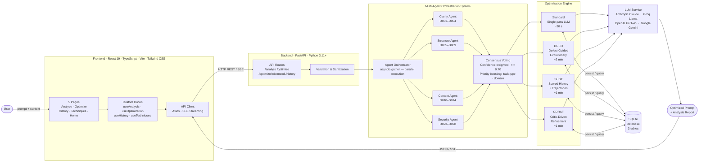
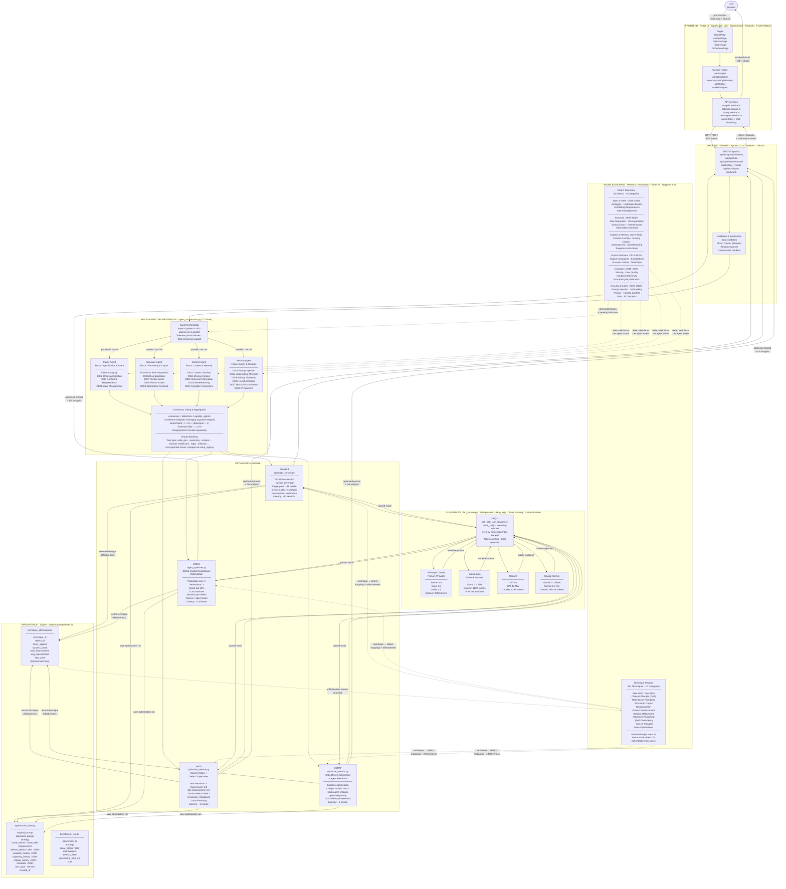

# PromptOptimizer Pro — Architecture Diagrams

> Mermaid diagrams for research paper inclusion.
> Requires Mermaid v10+ for `direction` inside subgraphs.

---

## Figure 1: High-Level System Architecture



---

## Figure 2: Comprehensive System Architecture & Data Flow



---

## Component Summary

| Layer | Components | Key Detail |
|---|---|---|
| **Frontend** | React 19, TypeScript, Vite, Tailwind | 5 pages · 5 hooks · 4 API services · SSE streaming |
| **Backend** | FastAPI, Python 3.11+, Pydantic | 6 routes · Input validation · Token counting |
| **Knowledge Base** | Defect Taxonomy, Technique Registry | 28 defects (6 categories) · 41+ techniques (10 categories) |
| **Multi-Agent** | 4 Specialized Agents + Orchestrator | Parallel via `asyncio.gather` · Consensus τ = 0.70 |
| **Optimization** | Standard, DGEO, SHDT, CDRAF | Single-pass · Evolutionary · Trajectory · Critic-driven |
| **LLM Service** | Anthropic, Groq, OpenAI, Gemini | Primary/fallback · Retry · Token tracking · Cost estimation |
| **Persistence** | SQLite (3 tables) | Optimization history · Technique effectiveness (learned) · Benchmarks |

### Optimization Strategy Parameters

| Strategy | Algorithm | Parameters | Latency |
|---|---|---|---|
| **Standard** | Technique selection → single-pass LLM rewrite → re-analysis | max 10 techniques | ~30 s |
| **DGEO** | Defect-Guided Evolutionary: Generate → Evaluate → Select → Crossover → Mutate | population = 5, generations = 3 | ~2 min |
| **SHDT** | Iterative improvement with defect trajectory tracking | max iterations = 4, target score = 8.0 | ~1 min |
| **CDRAF** | Baseline pass + agent-specific critique rounds | max critique rounds = 2 | ~1 min |

### Multi-Agent Consensus Algorithm

```
For each detected defect:
  consensus  = num_detections / num_capable_agents
  w_conf     = Σ(confidenceᵢ²) / Σ(confidenceᵢ)
  boost      = 1 + 0.1 × (num_detections − 1)
  final_conf = min(1.0, w_conf × boost × task_boost × domain_boost)
  if consensus ≥ τ (0.70) → include in final report
  else               → record as disagreement
```

---

## Figure 3: Backend Component Architecture

> Internal module structure of the FastAPI backend — all layers, their responsibilities, and inter-module dependencies.

```mermaid
flowchart TD
    subgraph ENTRY["Entry Point  ·  app.py"]
        APP["FastAPI Application\nCORS Middleware · Lifespan Manager\nHost 0.0.0.0 · Port 8000"]
    end

    subgraph ROUTES["Routes Layer"]
        direction LR
        R_AN["/api/analyze\n/api/analyze/stream\nanalyze.py"]
        R_OP["/api/optimize\n/api/techniques\noptimize.py"]
        R_HI["/api/optimize/advanced\n/api/history\n/api/history/stats\nhistory.py"]
        R_HE["/api/health\nhealth.py"]
    end

    subgraph SERVICES["Service Layer"]
        direction LR
        SVC_ORC["agent_orchestrator.py\nParallel orchestration\nConsensus voting\nPriority boosting\nSSE streaming\n717 lines"]
        SVC_OPT["optimizer_service.py\nStandard optimization\nSHDT trajectory\nCDRAF critique rounds\nTechnique selection"]
        SVC_DGE["dgeo_optimizer.py\nEvolutionary search\nPopulation management\nCrossover · Mutation\nFitness evaluation"]
        SVC_LLM["llm_service.py\nMulti-provider abstraction\ncall() · batch_call()\nRetry w/ backoff (3×)\nToken counting · Cost\n730+ lines"]
        SVC_DB["db_service.py\nSQLite persistence\nHistory · Effectiveness\nBenchmarks · Stats"]
        SVC_ANA["analyzer_service.py\nHigh-level wrapper\naround orchestrator"]
    end

    subgraph AGENTS["Agent Layer"]
        AG_BASE["base_agent.py\nAbstract analyze()\nMeta-prompt generation\nJSON response parsing\nTaxonomy enrichment"]
        AG_CL["clarity_agent.py\nD001–D004\nSpecification & Intent"]
        AG_ST["structure_agent.py\nD005–D009\nFormatting & Layout"]
        AG_CX["context_agent.py\nD010–D014\nContext & Memory"]
        AG_SC["security_agent.py\nD023–D028\nSafety & Security"]
        AG_BASE --> AG_CL & AG_ST & AG_CX & AG_SC
    end

    subgraph MODELS["Knowledge Models"]
        direction LR
        MOD_DT["defect_taxonomy.py\n28 Defects · 6 Categories\nSeverity · Indicators\nRemediation mapping\n684 lines"]
        MOD_TR["technique_registry.py\n41+ Techniques · 10 Categories\nEffectiveness scores\nDefect-to-technique map\n1588 lines"]
        MOD_IR["issue_registry.py\nUser issue → defect\nnatural language mapping\n553 lines"]
        MOD_RQ["request_models.py\nPydantic v2 DTOs\nAnalyzeRequest\nOptimizeRequest\nAdvancedOptimizeRequest"]
        MOD_RS["response_models.py\nAnalysisResponse\nOptimizationResponse\nAdvancedOptimizeResponse"]
    end

    subgraph UTILS["Utilities"]
        direction LR
        UT_VAL["validators.py\nInput sanitization\nEnum + range checks\nNull byte removal\n279 lines"]
        UT_TOK["token_counter.py\ntiktoken · LRU cache\nCost estimation\nContext limit guard\n262 lines"]
        UT_PAR["response_parser.py\nJSON extraction\nRequired field checks\nMalformed LLM output handling"]
        UT_ERR["error_handlers.py\nAPIKeyError\nRateLimitError\nTokenLimitError\nLLMServiceError"]
    end

    subgraph CONFIG["Configuration  ·  config.py  (476 lines)"]
        direction LR
        CFG_K["API Keys\nAnthropic · Groq\nOpenAI · Gemini"]
        CFG_M["Model Registry\nContext windows\nCost per 1K tokens\nStreaming support"]
        CFG_A["Agent Config\nNUM_AGENTS = 4\nCONSENSUS_THRESHOLD = 0.70\nTask-type priority boosts\nDomain priority boosts"]
        CFG_S["Strategy Params\nDGEO: pop=5 · gen=3\nSHDT: iter=4 · target=8.0\nCDRAF: rounds=2"]
    end

    subgraph DB["Persistence  ·  SQLite  ·  data/promptoptimizer.db"]
        direction LR
        DB_H["optimization_history\noriginal · optimized · strategy\nscores · improvement\nevolution/trajectory/critique JSON"]
        DB_T["technique_effectiveness\ntechnique_id · defect_id\ntimes_applied · avg_improvement\n(adaptive learning)"]
        DB_B["benchmark_results\nbenchmark_id · strategy\nscores · timing · cost"]
    end

    subgraph EXTERNAL["External  ·  LLM APIs"]
        direction LR
        EX_A["Anthropic\nClaude Sonnet 4.6\nClaude Opus 4.6\nClaude Haiku 4.5"]
        EX_G["Groq\nLlama 3.3 70B\n128K context"]
        EX_O["OpenAI\nGPT-4o\nGPT-4o Mini"]
        EX_M["Google\nGemini 2.0 Flash\nGemini 1.5 Pro\n1M–2M context"]
    end

    APP --> R_AN & R_OP & R_HI & R_HE

    R_AN --> SVC_ANA
    R_OP --> SVC_OPT
    R_HI --> SVC_OPT & SVC_DGE

    SVC_ANA --> SVC_ORC
    SVC_OPT --> SVC_ORC
    SVC_DGE --> SVC_ORC

    SVC_ORC --> AG_CL & AG_ST & AG_CX & AG_SC
    AG_CL & AG_ST & AG_CX & AG_SC --> SVC_LLM
    SVC_OPT --> SVC_LLM
    SVC_DGE --> SVC_LLM
    SVC_LLM --> EX_A & EX_G & EX_O & EX_M

    MOD_DT -.->|"defect definitions"| SVC_ORC
    MOD_DT -.->|"agent defect scope"| AG_CL & AG_ST & AG_CX & AG_SC
    MOD_TR -.->|"technique → defect map"| SVC_OPT
    MOD_IR -.->|"issue → defect map"| SVC_ORC
    CFG_A -.->|"consensus config"| SVC_ORC
    CFG_M -.->|"model selection"| SVC_LLM
    CFG_S -.->|"strategy params"| SVC_OPT & SVC_DGE

    R_AN & R_OP & R_HI --> UT_VAL
    SVC_LLM --> UT_TOK & UT_PAR

    SVC_OPT --> SVC_DB
    SVC_DGE --> SVC_DB
    SVC_DB --> DB_H & DB_T & DB_B
    DB_T -.->|"learned effectiveness\nfeedback"| MOD_TR
```



---

## Figure 4: Backend Request Processing Pipeline

> End-to-end algorithmic flow of a single optimization request through the backend — from API receipt to persisted response.

```mermaid
flowchart TD
    REQ(["API Request\nPOST /api/optimize/advanced\n{ prompt, strategy, task_type, domain }"])

    REQ --> VALID

    VALID{"Input Validation\nvalidators.py"}
    VALID -->|"invalid"| ERR(["400 Bad Request\nValidation error details"])
    VALID -->|"valid"| P1_START

    subgraph PHASE1["Phase 1 — Multi-Agent Defect Detection"]
        P1_START["Agent Orchestrator\nasyncio.gather — spawn 4 parallel tasks"]

        subgraph PARALLEL["Parallel LLM Calls  ·  Independent Execution"]
            direction LR
            AG1["Clarity Agent\nGenerate detection prompt\n→ LLM API call\n→ Parse JSON\n→ Enrich w/ taxonomy\nD001–D004"]
            AG2["Structure Agent\nGenerate detection prompt\n→ LLM API call\n→ Parse JSON\n→ Enrich w/ taxonomy\nD005–D009"]
            AG3["Context Agent\nGenerate detection prompt\n→ LLM API call\n→ Parse JSON\n→ Enrich w/ taxonomy\nD010–D014"]
            AG4["Security Agent\nGenerate detection prompt\n→ LLM API call\n→ Parse JSON\n→ Enrich w/ taxonomy\nD023–D028"]
        end

        CONS["Consensus Aggregation\n① Group detections by defect_id\n② consensus = detections ÷ capable_agents\n③ w_conf = Σ(conf²) ÷ Σ(conf)\n④ boost = 1 + 0.1 × (detections − 1)\n⑤ Apply task-type priority multipliers\n⑥ Apply domain priority multipliers\n⑦ Apply user-issue priority boosts\n⑧ Filter: τ = 0.70  →  disagreements below\n⑨ Sort by severity × final_confidence"]

        P1_START --> AG1 & AG2 & AG3 & AG4 --> CONS
    end

    CONS --> SKIP_CHK

    SKIP_CHK{"Overall score\n≥ 9.0 ?"}
    SKIP_CHK -->|"yes — already excellent"| NOOP(["Return original prompt\nno optimization applied"])
    SKIP_CHK -->|"no — proceed"| STRAT_SEL

    STRAT_SEL{"Strategy\nSelector"}

    %% ── STANDARD ──────────────────────────────────────
    subgraph STD["Standard  ·  optimizer_service.py"]
        direction TB
        ST1["Select techniques\nGreedy defect coverage\nRank by effectiveness score\nRespect optimization_level"]
        ST2["Single-pass LLM rewrite\nApply up to 10 techniques\nAnti-template validation"]
        ST3["Re-analyze optimized prompt\nAgent orchestrator (2nd pass)"]
        ST4["Compute improvement\nscore_after − score_before"]
        ST1 --> ST2 --> ST3 --> ST4
    end

    %% ── DGEO ──────────────────────────────────────────
    subgraph DGEO["DGEO  ·  dgeo_optimizer.py  ·  Defect-Guided Evolutionary Optimization"]
        direction TB
        DG1["Generate initial population\n5 variants — each targets\ndifferent defect subsets"]
        DG2["Evaluate fitness\nRe-analyze each variant\nScore = agent consensus score"]
        DG3["Select survivors\nKeep top 50%"]
        DG4["LLM Crossover\nCombine strengths of\ntop-2 scoring variants"]
        DG5["LLM Mutation\nApply remaining\ndefect remediations"]
        DG6{"Generation\n≤ 3 ?"}
        DG7["Return best variant\n+ full evolution history"]
        DG1 --> DG2 --> DG3 --> DG4 --> DG5 --> DG6
        DG6 -->|"next generation"| DG2
        DG6 -->|"complete"| DG7
    end

    %% ── SHDT ──────────────────────────────────────────
    subgraph SHDT["SHDT  ·  optimizer_service.py  ·  Scored History + Defect Trajectories"]
        direction TB
        SH1["Apply targeted improvements\nfor current defect set"]
        SH2["Re-analyze result\nagent orchestrator pass"]
        SH3["Record trajectory entry\ndefects_fixed · defects_remaining\ndefects_introduced · Δscore"]
        SH4{"Score > 8.0\nor Δ < 0.3\nor iterations > 4 ?"}
        SH5["Return best prompt\n+ full trajectory history"]
        SH1 --> SH2 --> SH3 --> SH4
        SH4 -->|"continue"| SH1
        SH4 -->|"converged"| SH5
    end

    %% ── CDRAF ─────────────────────────────────────────
    subgraph CDRAF["CDRAF  ·  optimizer_service.py  ·  Critic-Driven Refinement + Agent Feedback"]
        direction TB
        CD1["Standard baseline pass\n(technique selection + rewrite)"]
        CD2["Re-analyze optimized prompt\nall 4 agents as critics"]
        CD3["Collect per-agent critiques\nClarity · Structure · Context · Security\nfocus-area specific issues + remediations"]
        CD4["LLM refinement pass\nIncorporate agent feedback\nper critique round"]
        CD5{"Round\n≤ 2 ?"}
        CD6["Return refined prompt\n+ all critique rounds"]
        CD1 --> CD2 --> CD3 --> CD4 --> CD5
        CD5 -->|"next round"| CD2
        CD5 -->|"complete"| CD6
    end

    STRAT_SEL -->|"standard"| STD
    STRAT_SEL -->|"dgeo"| DGEO
    STRAT_SEL -->|"shdt"| SHDT
    STRAT_SEL -->|"cdraf"| CDRAF

    ST4 & DG7 & SH5 & CD6 --> PERSIST

    subgraph PERSIST["Persistence & Response Assembly  ·  db_service.py"]
        direction LR
        PS1["optimization_history\nSave original · optimized · strategy\nscores · techniques · metadata\nevolution / trajectory / critique JSON"]
        PS2["technique_effectiveness\nUpdate technique_id × defect_id\ntimes_applied · avg_improvement\n(adaptive learning signal)"]
        PS3["Build AdvancedOptimizeResponse\noriginal_prompt · optimized_prompt\nstrategy · score_before · score_after\nimprovement · strategy-specific history\ntoken usage · cost · processing_time_ms"]
        PS1 & PS2 --> PS3
    end

    PS3 --> RESP(["HTTP 200 — JSON Response\n+ SSE event stream\nto Frontend"])
```


